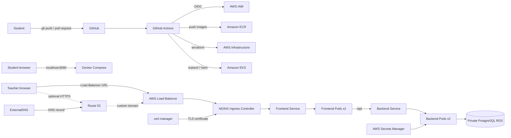

# CloudOps Academy — итоговый DevOps Capstone

## 1. Сценарий проекта

Команда разработки передала вам готовое приложение **CloudOps Academy**:

- `frontend/` — React-приложение;
- `backend/` — REST API на Node.js/Express;
- `database/init.sql` — исходная схема PostgreSQL.

Приложение позволяет студентам зарегистрироваться, пройти DevOps assessment,
сохранить результат и увидеть leaderboard. Ваша роль — **DevOps engineer**.
Изменять бизнес-логику frontend/backend не требуется. Вы должны упаковать
приложение в containers, создать облачную инфраструктуру, развернуть workload в
Kubernetes и построить безопасный CI/CD process.

В проекте проверяются три способа доступа к приложению:

1. **Localhost — обязательно:** локальный full stack запускается через Docker
   Compose и открывается по `http://localhost:8080`.
2. **AWS Load Balancer URL — обязательно:** приложение в EKS доступно по
   external hostname, созданному LoadBalancer Service. Покупать domain для этого
   не нужно.
3. **Custom domain + HTTPS — опционально:** если курс выдаёт student subdomain и
   доступ к Route 53, DNS и TLS обязательны. Если domain не выдан, Route 53,
   ExternalDNS и cert-manager считаются bonus-заданиями. Студент не обязан
   покупать domain за собственные деньги.

Проект должен восстанавливаться из Git repository по документации.

## 2. Целевая архитектура

Основной track проекта — **AWS**:



Эквивалентный GCP track (`GKE + Artifact Registry + Cloud SQL + Cloud DNS`)
разрешается только после согласования с преподавателем.

## 3. Что студент получает

Студенту выдаются:

- исходный код `frontend/`;
- исходный код `backend/`;
- SQL-схема;
- описание приложения и API;
- требования из этого документа;
- отдельный AWS account/sandbox или разрешённый учебный environment.

Студенту **не выдаются готовыми**:

- Dockerfiles;
- Docker Compose;
- Terraform implementation;
- Kubernetes manifests;
- готовые Helm charts/values (Helm использовать необязательно);
- GitHub Actions workflows;
- готовые AWS credentials;
- готовая база данных, DNS record или TLS certificate.

## 4. Общие правила

> **Helm не является обязательным требованием.** Приложение и controllers можно
> развернуть обычными Kubernetes YAML через `kubectl apply`. Helm разрешён и
> рекомендуется для сторонних controllers, но его отсутствие не снижает оценку,
> если все ресурсы воспроизводимо описаны в Git и проходят acceptance criteria.

1. Вся инфраструктура должна создаваться через Terraform. Ручное создание
   основных ресурсов в AWS Console не засчитывается.
2. Нельзя коммитить AWS keys, database passwords, kubeconfig, Terraform state,
   `.env` или private keys.
3. Все Docker images должны находиться в private ECR repositories.
4. Для CI/CD используйте GitHub OIDC, а не постоянные AWS access keys.
5. RDS не должен быть публично доступен.
6. Backend не должен быть доступен напрямую из интернета.
7. Все изменения должны проходить через Git commits с понятными сообщениями.
8. Проект должен удаляться через `terraform destroy` без ручного поиска
   ресурсов.
9. Студент отвечает за остановку платных AWS-ресурсов после проверки.

---

# Задания

## Task 1. Изучить приложение и подготовить план

### Требуется

1. Запустить frontend/backend локально удобным временным способом.
2. Определить:
   - frontend port;
   - backend port;
   - API prefix;
   - необходимые PostgreSQL environment variables;
   - health endpoint;
   - SQL tables приложения.
3. Нарисовать собственную architecture diagram.
4. Создать краткий implementation plan и оценку стоимости AWS.

### Deliverables

- раздел `Architecture` в README;
- диаграмма локального и cloud request flow;
- таблица ports, protocols и dependencies;
- список предполагаемых платных AWS services.

### Acceptance criteria

- студент может устно объяснить путь запроса от browser до PostgreSQL;
- нет предположения, что frontend подключается к PostgreSQL напрямую;
- определено, какие компоненты публичные, а какие private.

## Task 2. Containerize frontend и backend

### Требуется

1. Написать отдельный Dockerfile для frontend.
2. Использовать multi-stage build:
   - Node.js build stage;
   - Nginx runtime stage.
3. Настроить Nginx:
   - раздавать React static files;
   - поддерживать SPA fallback;
   - proxy `/api/*` в backend Service.
4. Написать Dockerfile для backend.
5. Запускать backend не от root user.
6. Добавить `.dockerignore` для обоих images.
7. Не копировать `.env`, `.git`, `node_modules` и build cache в images.
8. Использовать фиксированные major/minor base image versions.

### Deliverables

```text
frontend/Dockerfile
frontend/.dockerignore
frontend/nginx.conf
backend/Dockerfile
backend/.dockerignore
```

### Acceptance criteria

```bash
docker build -t cloudops-frontend:test frontend
docker build -t cloudops-backend:test backend
docker image ls
```

- оба images успешно собираются;
- frontend container возвращает HTML;
- backend container запускается с environment variables;
- в final frontend image отсутствуют Node.js source/build dependencies;
- backend process не работает от root.

## Task 3. Создать локальное full-stack окружение

### Требуется

Написать `docker-compose.yml` с тремя services:

- `database` — PostgreSQL;
- `backend` — Express API;
- `frontend` — Nginx/React.

Добавьте:

- named volume для PostgreSQL;
- автоматическое создание tables;
- healthcheck для database;
- healthcheck для backend;
- `depends_on` с health conditions;
- port mapping только для frontend;
- local-only database credentials;
- restart policy.

### Acceptance criteria

```bash
docker compose up --build -d
docker compose ps
curl http://localhost:8080/api/health
```

- database и backend имеют status `healthy`;
- приложение открывается на `http://localhost:8080`;
- регистрация, вход, assessment и leaderboard работают;
- данные сохраняются после `docker compose restart`;
- `docker compose down --volumes` создаёт чистую БД при следующем запуске.

Это первый обязательный checkpoint. Localhost подтверждает работоспособность
контейнеров, но не заменяет финальное развёртывание в AWS.

## Task 4. Настроить Terraform remote state

### Требуется

1. Создать отдельный S3 bucket для Terraform state.
2. Включить:
   - server-side encryption;
   - versioning;
   - public access block;
   - state locking.
3. Настроить Terraform S3 backend.
4. Не хранить state локально или в Git.
5. Добавить `.terraform.lock.hcl` в repository.

### Acceptance criteria

```bash
terraform init
terraform fmt -check -recursive
terraform validate
terraform plan
```

- state находится в S3;
- параллельный apply защищён locking mechanism;
- `terraform.tfstate` отсутствует в Git;
- преподаватель видит успешные `fmt`, `validate` и `plan`.

## Task 5. Создать AWS network через Terraform

### Требуется

Создать VPC минимум в двух Availability Zones:

- public subnets для load balancer/NAT;
- private subnets для EKS worker nodes;
- isolated database subnets для RDS;
- Internet Gateway;
- NAT Gateway;
- route tables и associations;
- Kubernetes subnet tags;
- общие tags `Project`, `Environment`, `ManagedBy`.

### Acceptance criteria

- CIDR ranges не пересекаются;
- worker nodes не имеют необходимости принимать прямой inbound internet traffic;
- RDS subnets не имеют public route;
- load balancer создаётся в public subnets;
- diagram соответствует реальному Terraform plan.

## Task 6. Создать ECR repositories

### Требуется

Через Terraform создать private repositories:

```text
cloudops-academy-frontend
cloudops-academy-backend
```

Настроить:

- image scan on push;
- lifecycle policy;
- tags по Git commit SHA;
- запрет использования только `latest` как deployment strategy.

### Acceptance criteria

```bash
aws ecr describe-repositories
aws ecr list-images --repository-name cloudops-academy-frontend
aws ecr list-images --repository-name cloudops-academy-backend
```

- оба images существуют в ECR;
- tag позволяет определить исходный Git commit;
- старые images автоматически ограничиваются lifecycle policy.

## Task 7. Создать private PostgreSQL RDS

### Требуется

Через Terraform создать PostgreSQL RDS:

- database subnet group в isolated subnets;
- encryption at rest;
- `publicly_accessible = false`;
- backup retention минимум 1 день для dev;
- storage autoscaling limit;
- Security Group с доступом на `5432` только от EKS workload/node security
  group;
- случайно сгенерированный password;
- database credentials в AWS Secrets Manager.

Запрещается:

- password в `.tf`/`.tfvars`/workflow/manifests;
- ingress `0.0.0.0/0` на PostgreSQL;
- public RDS endpoint.

### Database initialization

Создайте tables одним из способов:

- Kubernetes Job;
- migration container;
- migration step в CI/CD.

SQL нельзя выполнять вручную с laptop как единственный способ deployment.

### Acceptance criteria

- RDS status `available`;
- public access выключен;
- backend из EKS подключается к RDS;
- попытка подключиться к port `5432` из интернета не проходит;
- tables создаются повторяемым/idempotent способом.

## Task 8. Создать EKS cluster

### Требуется

Через Terraform создать:

- EKS control plane;
- managed node group в private subnets;
- минимум 2 desired nodes;
- min/desired/max scaling configuration;
- EKS access entries;
- необходимые IAM roles;
- cluster addons: CoreDNS, kube-proxy и VPC CNI.

### Acceptance criteria

```bash
aws eks update-kubeconfig --name CLUSTER_NAME --region AWS_REGION
kubectl get nodes
kubectl get pods -A
```

- nodes имеют status `Ready`;
- system pods работают;
- cluster access не зависит от общего administrator user;
- GitHub Actions имеет отдельный controlled access path.

## Task 9. Управлять database secrets

### Требуется

Backend должен получить:

```text
PGHOST
PGPORT
PGDATABASE
PGUSER
PGPASSWORD
```

Source of truth — AWS Secrets Manager. Для передачи secret в Kubernetes
используйте один из вариантов:

1. External Secrets Operator;
2. Secrets Store CSI Driver;
3. CI/CD synchronization в Kubernetes Secret.

В README объясните выбранный вариант и его trade-offs.

### Acceptance criteria

- secret value отсутствует в Git и Actions logs;
- Pod получает variables во время запуска;
- secret можно обновить без пересборки Docker image;
- преподаватель видит только secret names/metadata, но не password.

## Task 10. Написать Kubernetes manifests

### Требуется

Создать отдельный namespace `cloudops-academy` и manifests для frontend/backend.

Каждый Deployment должен иметь:

- 2 replicas;
- labels и selectors;
- image tag с Git SHA;
- container port;
- `resources.requests` и `resources.limits`;
- readiness probe;
- liveness probe;
- rolling update strategy;
- environment/secrets;
- non-root security context там, где это возможно.

Создайте Services:

- frontend — `ClusterIP`;
- backend — `ClusterIP`.

Backend Service не должен быть `LoadBalancer` или `NodePort`.

### Acceptance criteria

```bash
kubectl -n cloudops-academy get deployments
kubectl -n cloudops-academy get pods
kubectl -n cloudops-academy get services
kubectl -n cloudops-academy rollout status deployment/frontend
kubectl -n cloudops-academy rollout status deployment/backend
```

- обе replicas каждого Deployment имеют status `Ready`;
- Services имеют endpoints;
- frontend обращается к backend по Kubernetes DNS;
- удаление Pod приводит к автоматическому восстановлению replica.

## Task 11. Установить NGINX Ingress Controller

### Требуется

1. Установить NGINX Ingress Controller с помощью Kubernetes manifests или Helm.
2. Зафиксировать используемую версию controller; при выборе Helm также
   зафиксировать chart version.
3. Создать Ingress resource:
   - `/` → frontend Service;
   - `/api` → backend Service или frontend Nginx proxy — выбранный request path
     должен быть объяснён;
   - host задаётся только при использовании custom domain; без domain Ingress
     должен принимать запросы по Load Balancer hostname.
4. Убедиться, что только ingress controller создаёт public LoadBalancer.

### Acceptance criteria

```bash
kubectl get ingress -A
kubectl get service -n ingress-nginx
```

Если использовался Helm, дополнительно покажите `helm list -A`.

- AWS Load Balancer получает external address;
- frontend открывается по AWS Load Balancer URL без `kubectl port-forward`;
- при использовании custom domain запрос с правильным Host header также
  открывает frontend;
- `/api/health` возвращает HTTP 200;
- backend не имеет собственного public endpoint.

## Task 12. Настроить Route 53 и ExternalDNS

> Этот Task обязателен только тогда, когда преподаватель выдал student subdomain
> и доступ к учебной Route 53 hosted zone. Студент не должен покупать domain за
> собственные деньги. Без предоставленного domain Task 12 считается bonus.

### Требуется

1. Использовать subdomain, выданный преподавателем, например
   `student07.cloudops.example.com`.
2. Использовать учебную Route 53 hosted zone или delegated student hosted zone.
3. Установить ExternalDNS с помощью Kubernetes manifests или Helm.
4. Использовать IRSA/Pod Identity вместо AWS keys в Pod.
5. Ограничить ExternalDNS нужной hosted zone/domain filter.
6. Добавить необходимые annotations к Ingress/Service.

### Acceptance criteria

```bash
kubectl logs -n external-dns deployment/external-dns
dig YOUR_DOMAIN
curl -I http://YOUR_DOMAIN
```

- DNS record создаётся автоматически;
- record указывает на load balancer;
- удаление/изменение Ingress корректно отражается в DNS;
- ExternalDNS не может изменять чужие hosted zones.

## Task 13. Настроить TLS через cert-manager

> Этот Task обязателен только при наличии выданного преподавателем subdomain.
> Без учебного domain Task 13 считается bonus и не уменьшает основную оценку.

### Требуется

1. Установить cert-manager с помощью Kubernetes manifests или Helm.
2. Зафиксировать версию cert-manager; при выборе Helm также зафиксировать chart
   version.
3. Создать Let's Encrypt staging ClusterIssuer.
4. Проверить issuance в staging.
5. Создать production ClusterIssuer.
6. Настроить Ingress TLS section и HTTPS redirect.

### Acceptance criteria

```bash
kubectl get certificate,certificaterequest,challenge -A
curl -I https://YOUR_DOMAIN
openssl s_client -connect YOUR_DOMAIN:443 -servername YOUR_DOMAIN
```

- certificate имеет status `Ready=True`;
- browser не показывает certificate warning;
- HTTP перенаправляется на HTTPS;
- certificate renews automatically;
- private key не хранится в Git.

## Task 14. Настроить GitHub Actions с AWS OIDC

### Infrastructure workflow

Создайте workflow, который выполняет:

```text
checkout
→ OIDC authentication
→ terraform fmt -check
→ terraform init
→ terraform validate
→ terraform plan
→ terraform apply (manual approval only)
```

Требования:

- plan запускается на pull request;
- apply разрешён только из `main`/protected environment;
- используется concurrency lock;
- plan доступен преподавателю в Actions output/artifact;
- AWS keys не хранятся в repository secrets.

### Application workflow

Создайте workflow:

```text
checkout
→ tests
→ Docker build
→ vulnerability scan
→ ECR push with Git SHA
→ update Kubernetes manifests
→ database migration
→ kubectl deployment или Helm deployment
→ rollout verification
→ smoke test
```

### Acceptance criteria

- push в `main` автоматически разворачивает новую версию;
- failed build не меняет running deployment;
- workflow использует temporary AWS credentials;
- преподаватель может сопоставить running image tag с Git commit;
- smoke test проверяет AWS Load Balancer URL и `/api/health`;
- если используется custom domain, smoke test дополнительно проверяет HTTPS URL.

## Task 15. Добавить security и reliability controls

### Обязательные требования

- least-privilege IAM насколько возможно;
- protected GitHub environment для production apply;
- ECR image scanning;
- encrypted RDS storage;
- private RDS;
- Kubernetes resource limits;
- probes;
- Pod/container запускается не от root, если image позволяет;
- secrets не выводятся в logs;
- Terraform sensitive files находятся в `.gitignore`;
- минимум один backup/restore plan;
- rollback procedure для application deployment.

### Acceptance criteria

Студент демонстрирует:

```bash
kubectl -n cloudops-academy rollout history deployment/frontend
kubectl -n cloudops-academy rollout undo deployment/frontend
```

Также студент должен объяснить:

- что произойдёт при падении Pod;
- что произойдёт при падении одной node;
- где находится database backup;
- как rotation database password влияет на Pods;
- как ограничен доступ GitHub Actions.

## Task 16. Documentation и финальная защита

### README должен содержать

- описание приложения;
- architecture diagram;
- technologies;
- prerequisites;
- localhost instructions и URL `http://localhost:8080`;
- AWS bootstrap instructions;
- GitHub variables/secrets без значений secrets;
- deployment process;
- AWS Load Balancer access instructions;
- DNS/TLS configuration, если выполнена optional domain-часть;
- troubleshooting;
- rollback procedure;
- cleanup procedure;
- screenshots работающего приложения;
- известные ограничения.

### На защите студент показывает

1. Git repository и commit history.
2. Успешный GitHub Actions run.
3. Terraform state/backend и последний plan.
4. ECR images с Git SHA.
5. `kubectl get pods,services,ingress`.
6. Локальное приложение на `http://localhost:8080`.
7. Облачное приложение по AWS Load Balancer URL.
8. HTTPS custom domain, если domain был предоставлен или выполнен как bonus.
9. Регистрацию нового пользователя.
10. Прохождение assessment и сохранение score.
11. Backend/RDS connectivity.
12. Удаление Pod и автоматическое восстановление.
13. Rollout или rollback.
14. Отсутствие secrets в Git.

---

# Итоговые deliverables

Ожидаемая структура repository:

```text
.
├── .github/workflows/
│   ├── terraform.yml
│   └── deploy.yml
├── backend/
│   ├── Dockerfile
│   └── .dockerignore
├── frontend/
│   ├── Dockerfile
│   ├── .dockerignore
│   └── nginx.conf
├── database/
├── kubernetes/
│   ├── namespace.yml
│   ├── backend.yml
│   ├── frontend.yml
│   ├── ingress.yml
│   └── database-migration.yml
├── terraform/
│   ├── backend.tf
│   ├── versions.tf
│   ├── variables.tf
│   ├── networking.tf
│   ├── eks.tf
│   ├── ecr.tf
│   ├── rds.tf
│   ├── iam.tf
│   ├── dns.tf
│   └── outputs.tf
├── helm-values/                 # optional, только если выбран Helm
│   ├── ingress-nginx.yml
│   ├── external-dns.yml
│   └── cert-manager.yml
├── docker-compose.yml
└── README.md
```

# Evidence checklist

Добавьте в README или отдельный `EVIDENCE.md`:

- [ ] localhost screenshot (`http://localhost:8080`);
- [ ] ссылка на AWS Load Balancer application URL;
- [ ] ссылка на HTTPS custom domain, если выполнена optional domain-часть;
- [ ] ссылка на successful infrastructure workflow;
- [ ] ссылка на successful deployment workflow;
- [ ] screenshot `terraform plan` summary;
- [ ] screenshot ECR repositories/images;
- [ ] screenshot EKS nodes;
- [ ] screenshot Pods/Services/Ingress;
- [ ] screenshot Route 53 record, если используется custom domain;
- [ ] screenshot valid TLS certificate, если используется custom domain;
- [ ] screenshot application dashboard;
- [ ] screenshot assessment/leaderboard;
- [ ] результат `/api/health`;
- [ ] краткая cost report;
- [ ] подтверждение cleanup после проверки.

# Оценивание — 100 баллов

| Раздел | Баллы |
| --- | ---: |
| Dockerfiles и Docker Compose | 10 |
| Terraform quality и remote state | 10 |
| VPC/networking | 10 |
| ECR и image lifecycle | 5 |
| Private RDS и database initialization | 10 |
| EKS и Kubernetes workloads | 15 |
| Ingress, Route 53 и ExternalDNS | 10 |
| cert-manager и HTTPS | 8 |
| GitHub Actions и OIDC | 12 |
| Security/reliability | 5 |
| README, evidence и защита | 5 |
| **Всего** | **100** |

Если курс не предоставляет domain, 18 обязательных баллов за DNS/TLS
перераспределяются так: VPC/networking `+4`, EKS/Kubernetes `+4`, GitHub
Actions/OIDC `+5`, security/reliability `+3`, documentation/defense `+2`.
Студент по-прежнему может выполнить DNS/TLS как bonus по согласованию.

## Критические требования

Даже при высокой сумме проект не может получить проходную оценку, если:

- приложение недоступно преподавателю через HTTPS subdomain или, если domain
  не был предоставлен курсом, через AWS Load Balancer URL;
- в Git найдены реальные credentials/secrets;
- RDS открыт в интернет;
- отсутствует Terraform code;
- images не находятся в private registry;
- deployment выполняется только вручную;
- HTTPS certificate невалиден, когда студенту был предоставлен учебный domain;
- студент не может объяснить request flow.

# Bonus — до 15 дополнительных баллов

- отдельные `dev` и `prod` environments — 3;
- reusable Terraform modules — 2;
- Trivy/Snyk image scan с quality gate — 2;
- Prometheus/Grafana monitoring — 3;
- centralized logs — 2;
- Horizontal Pod Autoscaler — 1;
- AWS Load Balancer Controller вместо NGINX — 1;
- backup restore demonstration — 1.

# Рекомендуемый срок

- индивидуально: 2 недели;
- команда из 2 студентов: 7–10 дней;
- рекомендуемая нагрузка: 25–40 часов;
- checkpoint 1: localhost + containers (`http://localhost:8080`);
- checkpoint 2: Terraform + AWS infrastructure;
- checkpoint 3: Kubernetes + CI/CD;
- финал: AWS Load Balancer URL + защита;
- optional/выданный курсом domain: DNS + HTTPS.
