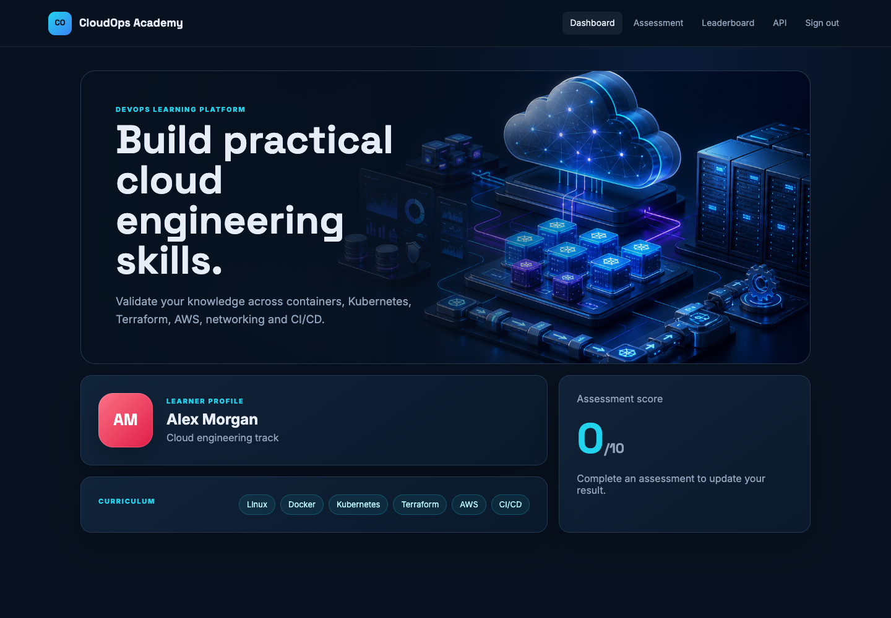
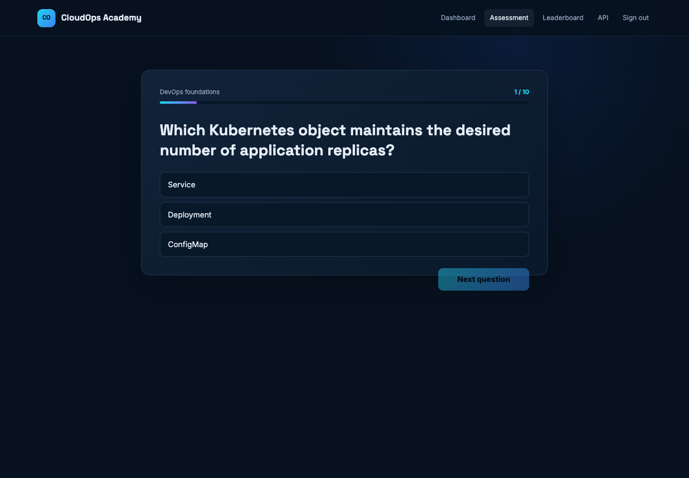
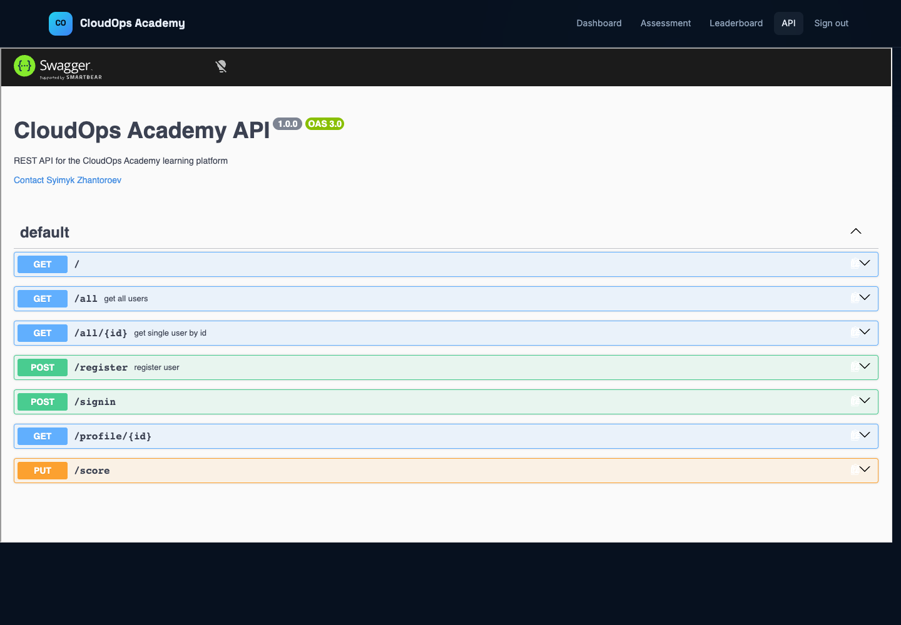

# CloudOps Academy — Student Starter

Это starter repository для итогового DevOps capstone.

## Как должен выглядеть готовый проект

После выполнения задания студент получит работающую учебную платформу CloudOps
Academy. Скриншоты показывают ожидаемый application result; infrastructure,
containers и deployment студент создаёт самостоятельно.

### Вход и регистрация

| Sign in | Create account |
| --- | --- |
|  |  |

### Dashboard

### DevOps assessment

### Leaderboard

### Swagger API documentation

Вам предоставлен только готовый application layer:

- `frontend/` — React frontend;
- `backend/` — Node.js/Express REST API;
- `database/init.sql` — PostgreSQL schema;
- `ASSIGNMENT.md` — полное техническое задание;
- `PREREQUISITES.md` — необходимые знания, инструменты и доступы;
- `GRADING_RUBRIC.md` — правила оценивания и уровни выполнения;
- `TROUBLESHOOTING.md` — безопасная диагностика типичных ошибок;
- `COST_AND_CLEANUP.md` — AWS budget и обязательное удаление ресурсов.

Начните с [требований перед стартом](PREREQUISITES.md), затем прочитайте
[полное задание](ASSIGNMENT.md) и [критерии оценки](GRADING_RUBRIC.md).
Ваша задача — самостоятельно
создать containerization, local environment, cloud infrastructure, Kubernetes,
CI/CD, DNS и HTTPS.

В starter намеренно отсутствуют:

- Dockerfiles и Docker Compose;
- Terraform;
- Kubernetes manifests;
- Helm configuration (Helm необязателен);
- GitHub Actions workflows;
- готовые cloud resources и credentials.

Не добавляйте реальные passwords, access keys, Terraform state, `.env` или
private keys в Git.
